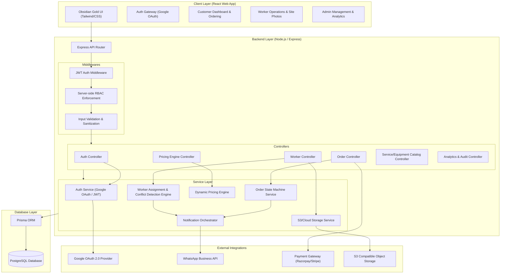
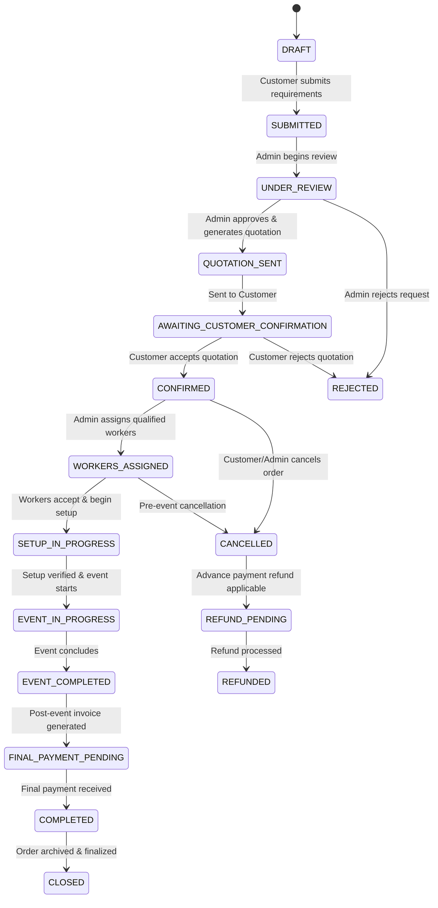

# Bhakti Studio — System Architecture & Specification

## 1. High-Level Architecture Overview

Bhakti Studio is designed as a enterprise-grade event-production management platform built on a layered architecture separating concerns across client applications, backend services, relational database persistence, and external service integrations.

### Architecture Diagram

---

## 2. Order Lifecycle & State Machine Transitions

Orders follow a strict, deterministic state machine. State transitions are controlled server-side and trigger automated audit logging and notifications.

### State Diagram

### Complete State Machine Transition Table

| Source State | Target State | Triggered By | Conditions & Rules | Automated Actions |
| :--- | :--- | :--- | :--- | :--- |
| `DRAFT` | `SUBMITTED` | Customer | Minimum required event details & contact info present. | Calculates estimated quotation; notifies Admin. |
| `SUBMITTED` | `UNDER_REVIEW` | Admin | Admin locks order for pricing review. | Prevents customer editing. |
| `UNDER_REVIEW` | `QUOTATION_SENT` | Admin | Admin sets/approves final itemized quotation. | Generates Quotation V[N]; sends notification to Customer. |
| `QUOTATION_SENT` | `AWAITING_CONFIRMATION` | System | Transition automatically applied upon quotation delivery. | Customer alert via App/WhatsApp. |
| `AWAITING_CONFIRMATION` | `CONFIRMED` | Customer | Customer approves quotation & pays advance (if required). | Locks event date & inventory requirements; alerts Admin. |
| `AWAITING_CONFIRMATION` | `REJECTED` | Customer | Customer declines quotation with reason. | Logs rejection audit; releases pending inventory lock. |
| `CONFIRMED` | `WORKERS_ASSIGNED` | Admin | All required service roles are filled with verified available workers. | Dispatches assignment requests & WhatsApp links to workers. |
| `WORKERS_ASSIGNED` | `SETUP_IN_PROGRESS` | Worker | Worker accepts assignment & checks in on site. | Enables before-event photo upload portal. |
| `SETUP_IN_PROGRESS` | `EVENT_IN_PROGRESS` | Worker / Admin | Setup verified; post-setup photos uploaded. | Updates event status feed. |
| `EVENT_IN_PROGRESS` | `EVENT_COMPLETED` | Worker / Admin | Event concluded; dismantling completed. | Unlocks assigned workers and inventory. |
| `EVENT_COMPLETED` | `FINAL_PAYMENT_PENDING` | System / Admin | Final audit completed. | Generates final invoice; requests remaining balance. |
| `FINAL_PAYMENT_PENDING` | `COMPLETED` | Admin / Gateway | Remaining balance fully settled. | Issues receipt; updates financial analytics. |
| `COMPLETED` | `CLOSED` | System / Admin | Order archived after retention period. | Order moved to read-only archive status. |
| `CONFIRMED` / `WORKERS_ASSIGNED` | `CANCELLED` | Customer / Admin | Cancellation requested before event start. | Triggers refund evaluation algorithm based on cancellation window. |
| `CANCELLED` | `REFUND_PENDING` | Admin | Refund amount approved. | Queue refund request with Payment Gateway. |
| `REFUND_PENDING` | `REFUNDED` | Payment Gateway | Payment gateway confirms transaction. | Issues credit note; updates audit logs. |

---

## 3. Server-Side RBAC Permission Matrix

Server-side middleware strictly validates token identity and role claims before controller execution. Frontend role UI toggles are purely advisory.

| Endpoint Category | HTTP Method & Path | ADMIN | CUSTOMER | WORKER |
| :--- | :--- | :---: | :---: | :---: |
| **Auth** | `POST /api/v1/auth/google` | Public | Public | Public |
| | `GET /api/v1/auth/me` | ✅ | ✅ | ✅ |
| **Orders** | `POST /api/v1/orders` | ✅ | ✅ (Own) | ❌ |
| | `GET /api/v1/orders` | ✅ (All) | ✅ (Own) | ✅ (Assigned) |
| | `GET /api/v1/orders/:id` | ✅ | ✅ (Owner) | ✅ (Assigned) |
| | `PATCH /api/v1/orders/:id/status` | ✅ | ❌ | ❌ |
| | `POST /api/v1/orders/:id/cancel` | ✅ | ✅ (Owner) | ❌ |
| **Quotations** | `GET /api/v1/orders/:id/quotation` | ✅ | ✅ (Owner) | ❌ |
| | `PUT /api/v1/orders/:id/quotation` | ✅ | ❌ | ❌ |
| | `POST /api/v1/orders/:id/quotation/accept` | ❌ | ✅ (Owner) | ❌ |
| **Worker Operations** | `GET /api/v1/workers` | ✅ | ❌ | ❌ |
| | `POST /api/v1/workers/assign` | ✅ | ❌ | ❌ |
| | `POST /api/v1/workers/assignments/:id/respond` | ❌ | ❌ | ✅ (Assignee) |
| | `POST /api/v1/workers/assignments/:id/photos` | ❌ | ❌ | ✅ (Assignee) |
| | `GET /api/v1/workers/me/schedule` | ❌ | ❌ | ✅ (Self) |
| **Catalog & Services** | `GET /api/v1/services` | ✅ | ✅ (Active) | ✅ (Active) |
| | `POST /api/v1/services` | ✅ | ❌ | ❌ |
| | `PUT /api/v1/services/:id` | ✅ | ❌ | ❌ |
| **Pricing Engine** | `GET /api/v1/pricing/rules` | ✅ | ❌ | ❌ |
| | `PUT /api/v1/pricing/rules` | ✅ | ❌ | ❌ |
| | `POST /api/v1/pricing/calculate-estimate` | ✅ | ✅ | ❌ |
| **Payments** | `POST /api/v1/payments/create-intent` | ✅ | ✅ (Owner) | ❌ |
| | `POST /api/v1/payments/webhook` | Gateway Signature Verified | Gateway Signature Verified | Gateway Signature Verified |
| **Analytics & Logs** | `GET /api/v1/analytics/dashboard` | ✅ | ❌ | ❌ |
| | `GET /api/v1/analytics/audit-logs` | ✅ | ❌ | ❌ |

---

## 4. Conflict-Detection & Inventory Rules

To prevent double-booking workers or over-committing equipment for overlapping events, the backend executes conflict detection rules before order confirmation and worker assignment.

### 4.1 Worker Schedule Conflict Engine

When assigning a worker $W$ to Order $O_{new}$ spanning $[T_{start}^{new}, T_{end}^{new}]$:

1. **Time Overlap Check**:
   $$\text{Conflict}(W) = \exists \, O_{existing} \in \text{AssignedJobs}(W) \quad \text{s.t.} \quad (T_{start}^{new} < T_{end}^{exist} + \Delta_{buffer}) \land (T_{end}^{new} > T_{start}^{exist} - \Delta_{buffer})$$
   *(where $\Delta_{buffer}$ is the default 2-hour setup/transit window).*

2. **Leave Status Check**:
   Worker must not have an approved leave record spanning any date within $[T_{start}^{new}, T_{end}^{new}]$.

3. **Status Check**:
   Worker profile status must be `ACTIVE` and `AVAILABLE`.

4. **Skill Matching**:
   Required role in $O_{new}$ (e.g. `LED_TECHNICIAN`, `SOUND_ENGINEER`) must match worker's certified skill set.

---

### 4.2 Equipment & Inventory Availability Calculation

Equipment availability is computed dynamically against existing confirmed/in-progress orders:

$$\text{AvailableQty}(E, [T_{start}, T_{end}]) = \text{TotalStock}(E) - \sum_{O_{i} \in \text{ActiveOrders}([T_{start}, T_{end}])} \text{RequiredQty}(E, O_{i})$$

- If $\text{AvailableQty}(E) < \text{RequestedQty}(E)$, the system flags an **Inventory Shortage Warning** to the Admin.
- The Admin can choose to mark the requirement as "Outsourced / Sub-rented" or reject the requirement.
